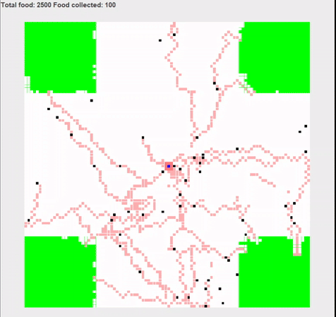

# Ant Simulator

Simulador de colônia de formigas, implementado em Java, utilizando Swing para interface gráfica. O propósito do projeto é simular, por meio da orientação de objetos, o comportamento das formigas na busca por alimentos para a sua colônia.

</img>

## Como funciona

Dada uma matriz de Fields, que são objetos que seguram UniverseObjects, que por sua vez são objetos que representam 
os participantes elementares da simulação (formiga, colônia e comida), a simulação começa com a colônia colocando formigas à procura de alimento.
Ao encontrá-los inicia sua rota de volta para casa, deixando para trás um rastro de volta ao alimento, para, quando uma formiga entrar nesse rastro,
dependo do seu objetivo, conseguir encontrar a colônia ou alimento. A simulação encerra quando todos os alimentos são coletados.

## Classes Principais

### Ant
Representa a formiga, e contém todos os algoritmos para sua movimentação e procura de alimentos.

### AntColony
Modela a colônia de formigas, contém os métodos para criar formigas e é o ponto final do processo de busca por alimentos.

### Food
Representa o alimento a ser coletado

## Comportamento das formigas

Um dos atributos do campo Field que compõe a matriz da simulação é o arrow, que é do tipo Direction (enum de direções possíveis de movimentação), e orienta a direção em que a formiga deve ir.
Inicialmente esse atributo começa como nulo, mas, quando uma formiga passa por esse campo carregando alimento, se o arrow desse field estiver null, ela set o arrow para a direção que ela foi logo em seguida.
Quando uma formiga desorientada encontra um arrow, se ela estiver buscando a colônia ela vai na direção que o arrow aponta, caso contrário, caso esteja em busca de comida, ela segue a direção contrária do arrow.

Quando não estiver perto de um campo arrow, sua movimentação será aleatória, mas não para as 8 possíveis direções. Ao nascer, dependendo de onde ela é colocada no raio da colônia, ela tem um arco de procura que
usado toda vez que precisar escolher aleatoriamente um caminho a seguir, de forma a garantir que ela siga uma direção. Por exemplo se a colônia coloca a formiga ao norte, o seu raio de busca será norte, nordeste e noroeste, ou seja,
as duas direções adjacentes à direção em que nasceu. Ela também possui um arco de volta, que possui as direções opostas do arco de busca e é utilizado quando está voltando para a colônia, e não possui um arrow à disposição.
